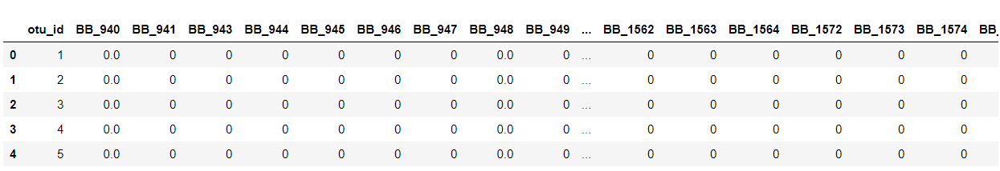

# BellyButton_Biodiversity

### Objective:
Build an interactive dashboard to explore the [Belly Button Biodiversity DataSet](http://robdunnlab.com/projects/belly-button-biodiversity/)

### Step 1 - Flask API

Use Flask to design an API for the dataset and to serve the HTML and JavaScript required for the dashboard page.Read the CSV data directly into Pandas DataFrames and output the data as JSON in the flask routes.
  
  

* First, create a template called `index.html` for the dashboard landing page. Use the Bootstrap grid system to create the structure of the dashboard page.
