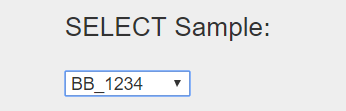
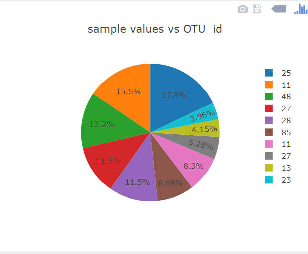
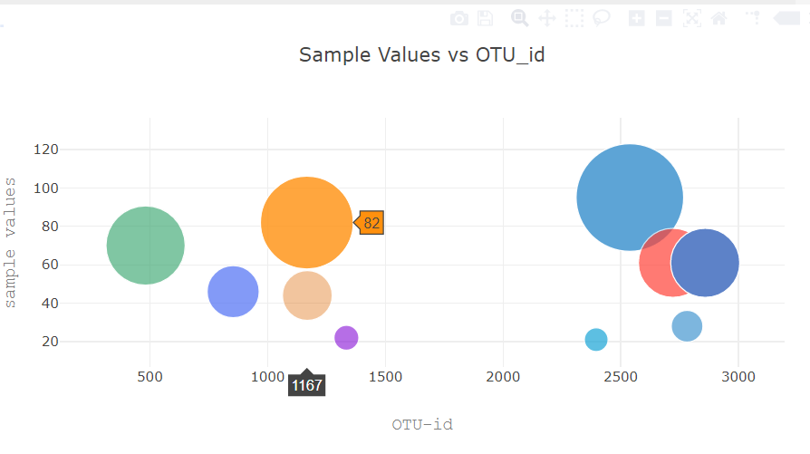

# BellyButton_Biodiversity

### Objective:
Build an interactive dashboard to explore the [Belly Button Biodiversity DataSet](http://robdunnlab.com/projects/belly-button-biodiversity/)

### Step 1 - Read the csv files into pandas dataFrames

Read the CSV data directly into Pandas DataFrames and output the data as JSON in the flask routes.
  * BellyButton_Biodiversity_Samples
  
  
  
  * OTU Description
  
  
  
  * Sample Metadata
  
  
  
  * Metadata dictionary
  
  
  


* First, create a template called `index.html` for the dashboard landing page. Use the Bootstrap grid system to create the structure of the dashboard page.

### Flask API
Use Flask to design an API for the dataset and to serve the HTML and JavaScript required for the dashboard page.
* create the following routes for the api.

```python
@app.route("/")
    """Return the dashboard homepage."""
```
```python
@app.route('/names')
    """List of sample names.

    Returns a list of sample names in the format
    [
        "BB_940",
        "BB_941",
        "BB_943",
        "BB_944",
        "BB_945",
        "BB_946",
        "BB_947",
        ...
    ]

    """
```
```python
@app.route('/otu')
    """List of OTU descriptions.

    Returns a list of OTU descriptions in the following format

    [
        "Archaea;Euryarchaeota;Halobacteria;Halobacteriales;Halobacteriaceae;Halococcus",
        "Archaea;Euryarchaeota;Halobacteria;Halobacteriales;Halobacteriaceae;Halococcus",
        "Bacteria",
        "Bacteria",
        "Bacteria",
        ...
    ]
    """
```
```python
@app.route('/metadata/<sample>')
    """MetaData for a given sample.

    Args: Sample in the format: `BB_940`

    Returns a json dictionary of sample metadata in the format

    {
        AGE: 24,
        BBTYPE: "I",
        ETHNICITY: "Caucasian",
        GENDER: "F",
        LOCATION: "Beaufort/NC",
        SAMPLEID: 940
    }
    """
```
```python
@app.route('/wfreq/<sample>')
    """Weekly Washing Frequency as a number.

    Args: Sample in the format: `BB_940`

    Returns an integer value for the weekly washing frequency `WFREQ`
    """
```
```python
@app.route('/samples/<sample>')
    """OTU IDs and Sample Values for a given sample.

    Sort the Pandas DataFrame (OTU_ID and Sample Value)
    in Descending Order by Sample Value

    Return a list of dictionaries containing sorted lists  for `otu_ids`
    and `sample_values`

    [
        {
            otu_ids: [
                1166,
                2858,
                481,
                ...
            ],
            sample_values: [
                163,
                126,
                113,
                ...
            ]
        }
    ]
    """
```

---
## Step 2 - Plotly.js

Use Plotly.js to build interactive charts for the dashboard.

* Use the route `/names` to populate a dropdown select element with the list of sample names.

  * Use `document.querySelector`, `document.createDocumentFragment` and `fragment.appendChild` to populate the create option elements and append them to the dropdown selector.

  * Use the following HTML tag for the dropdown selector

  ```html
  <select class="select_width" id="selectSample" onchange="optionChanged(this.value)">
  ```
  * Create a function called `optionChanged` to handle the change event when a new sample is selected (i.e. fetch data for the newly selected sample).

  
  
  * Create a PIE chart that uses data from the routes `/samples/<sample>` and `/otu` to display the top 10 samples.

  * Use the Sample Value as the values for the PIE chart

  * Use the OTU ID as the labels for the pie chart
  
  * Use `Plotly.restyle` to update the chart whenever a new sample is selected

  
  
  * Create a Bubble Chart that uses data from the routes `/samples/<sample>` and `/otu` to plot the __Sample Value__ vs the __OTU ID__ for the selected sample.

  * Use the OTU IDs for the x values

  * Use the Sample Values for the y values

  * Use the Sample Values for the marker size

  * Use the OTU IDs for the marker colors

  * Use the OTU Description Data for the text values

  * Use `Plotly.restyle` to update the chart whenever a new sample is selected

  

* Display the sample metadata from the route `/metadata/<sample>`

  * Display each key/value pair from the metadata JSON object somewhere on the page

  * Update the metadata for each sample that is selected


